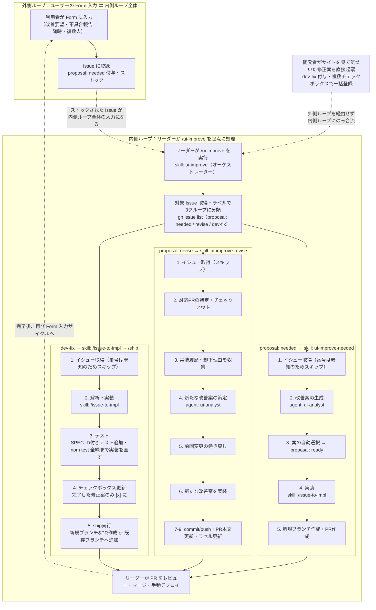

# aa4h-forest-rangers

クライアント社内システムのUI/UX刷新プロジェクト。  
Claude Code を活用した AI 駆動開発で、GitHub Issue を起点に実装・テスト・デプロイを自動化している。

---

## ファイル構成（主要）

| ファイル | 役割 |
|---|---|
| `index.html` | AIAgent サイトの入り口 |
| `dev-environment.html` | 本プロジェクトの開発資料（スライド形式） |
| `assets/` | CSS・JS アセット |
| `.claude/skills/` | 開発自動化スキル群 |

---

## index.html — AIAgent サイト

社内 AI Agent プラットフォームのフロントエンド入り口。  
HTML / CSS / バニラ JS のみで構成し、クライアント既存 API を呼び出して情報を表示する。

**技術スタック**

- HTML / CSS / バニラ JS（フレームワーク不使用）
- テーマ値は CSS 変数（`--` プレフィックス）で一元管理
- テスト: Playwright
- デプロイ: リーダーが手動実行

---

## 開発フロー — UI/UX 改善サイクル

Claude Code が GitHub Issue を元にUI/UXの改善提案を行う。

```
/ui-improve（オーケストレーター）
  ├─ proposal:needed のIssue → /ui-improve-needed → 新規ブランチ & PR 作成
  ├─ proposal:revise のIssue → /ui-improve-revise → 既存ブランチに再実装 & PR 更新
  └─ dev-fix のIssue → /issue-to-impl（実装+テスト） → /ship → 新規/既存ブランチで PR 作成・更新

PR → リーダーレビュー & マージ → リーダーが任意のタイミングでデプロイ
```

| ステップ | 担当 | 内容 |
|---|---|---|
| `/ui-improve` | Claude Code | `proposal:needed` / `proposal:revise` / `dev-fix` ラベルの Issue を全件取得し、サブスキルに並列委譲 |
| `/ui-improve-needed` | Claude Code | 新規 Issue を解析 → 改善案生成 → 実装 → 新規ブランチで PR 作成 |
| `/ui-improve-revise` | Claude Code | 既存 PR の却下理由を収集 → 前回変更を巻き戻し → 再実装 → PR を更新 |
| dev-fix 対応 | Claude Code | `dev-fix` Issue（開発者発・複数修正案を一括起票）を `/issue-to-impl` で解析・実装・テスト（SPEC-ID付きテストを追加し `npm test` 全緑を確認）→ チェックボックス更新 → `/ship` でPR作成/既存PRへの追加 |
| 承認 & マージ | リーダー | PR をレビューし main へマージ。任意のタイミングで手動デプロイ |

### 全体像（外側ループ ⇄ 内側ループ）

ユーザーが Form に入力して Issue を登録する **外側ループ** と、リーダーが `/ui-improve` を起動して処理する **内側ループ** が連動して回る。内側ループが完了（マージ・デプロイ）すると、再び外側ループの Form 入力サイクルに戻る。

`dev-fix` Issue は外側ループを経由せず、開発者がサイトを見て気づいた修正案を直接起票するため、内側ループにのみ合流する（下図の破線）。



---

## 資料作成フロー — dev-environment.html

本プロジェクトの開発環境・フロー・スキル構成をまとめたスライドドキュメント。  
キーボード（← →）またはナビゲーションボタンでスライドを切り替えられる。

**主なコンテンツ:** プロジェクト概要 / AIAgent サイト利用フロー / 開発フロー / Skills・エージェント一覧 / ブランチ戦略

### 更新方法

`/update-dev-env` を実行すると、動的な部分を自動で最新化したうえで、必要に応じて手動指示による修正も適用できる。

```
/update-dev-env
```

**毎回自動で更新されるスライド（動的な部分）:**

| スライド | 更新内容 |
|---|---|
| サイトマップ | `index.html` のナビゲーションを読み取り、大きな画面遷移が変わった場合に反映 |
| ディレクトリ構成 | プロジェクトの実際のフォルダ構成を読み取り、常に最新状態を反映 |
| Skills・エージェント一覧 | `.claude/skills/` と `.claude/agents/` を読み取り、全件を反映。ページが増える場合は自動で追加 |

**スライドの文言・構成を手動で変更する場合（任意）:**

1. [`.claude/documents/updateFormat.md`](.claude/documents/updateFormat.md) をローカルにコピーし、修正目的・対象スライド・変更内容を記入する
2. 記入済みファイルを添付して `/update-dev-env` を実行する
3. 自動更新に加えて、指定スライドの修正も同時に適用される

---

## コーディングルール（抜粋）

- テーマ値は必ず CSS 変数で管理、インラインスタイル禁止
- レイアウトと色は分離して管理
- モックデータと本番 API 呼び出しは差し替えやすい構造にする
- セマンティックタグを使う
- コメントは「なぜそうしているか」のみ（何をしているかは書かない）

詳細は [CLAUDE.md](CLAUDE.md) を参照。
